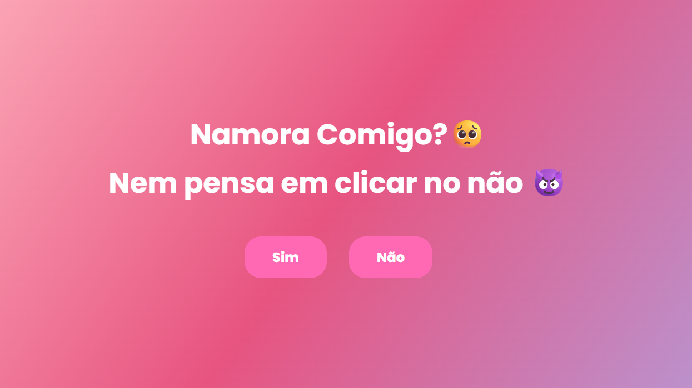

# 💖 Pedido de Namoro Interativo

Um site divertido e romântico feito para fazer um pedido de namoro de uma forma criativa!  
O usuário se depara com duas opções: "Sim" e "Não", mas... ao tentar clicar em "Não", o botão escapa! 😅  
Depois de algumas tentativas frustradas, o botão "Não" desaparece e só sobra uma opção possível: "Sim".  
Impossível dizer não a esse amor! 💘

## 🚀 Funcionalidades

- Botão "Não" que muda de posição aleatoriamente ao ser clicado
- "Não" desaparece após várias tentativas
- Mensagem final ao clicar em "Sim"
- Design leve e responsivo
- Ideal para brincadeiras de casal e conteúdo viral 💌

## 🎯 Tecnologias Utilizadas

- HTML5
- CSS3
- JavaScript (puro)

💡 Inspiração
Esse projeto foi feito com o intuito de surpreender alguém especial e também praticar HTML, CSS e JavaScript de forma divertida.

📬 Contato
Se quiser trocar ideias ou tiver sugestões:

Instagram: im.germano

Email: germanosorte9@gmail.com